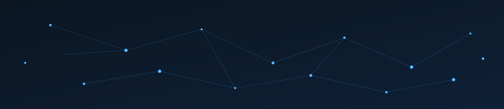

## 👨‍💻 About Me

- 🎓 Engineering student, passionate about computer science
- 🌍 Learning **GIS / Geomatics** (Geographic Information Systems)
- 🐍 Main skills in **Python**, getting started with **Web development**
- 🌐 My website: [allane.xyz](https://allane.xyz)
